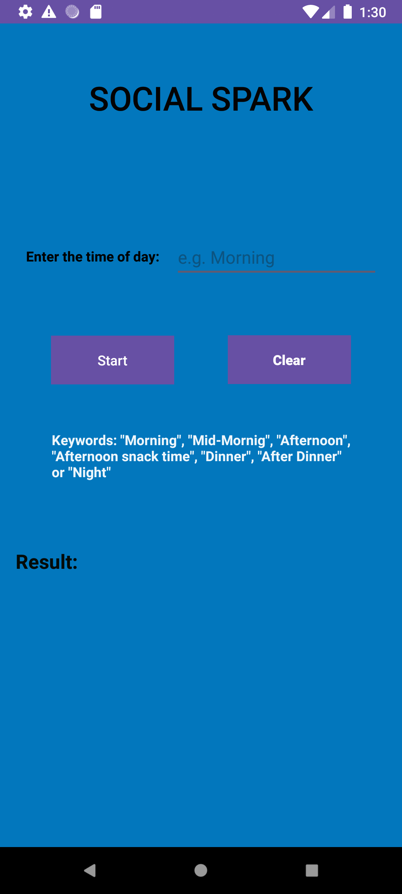
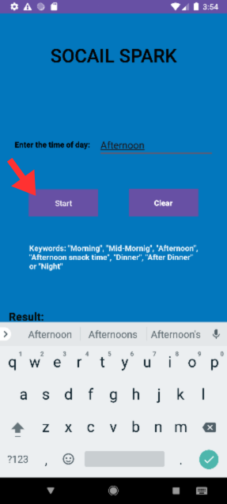
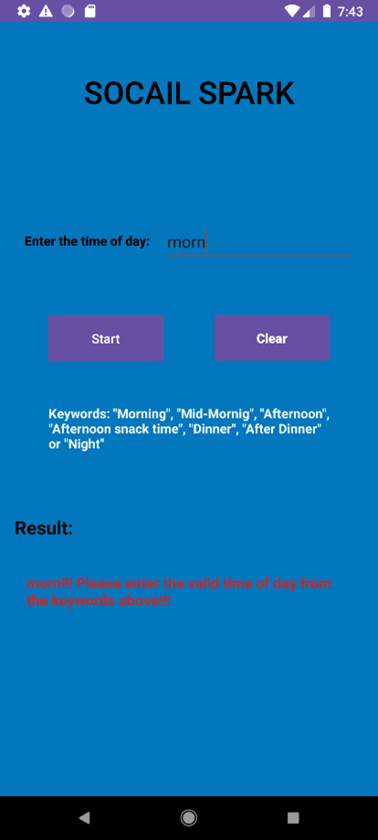
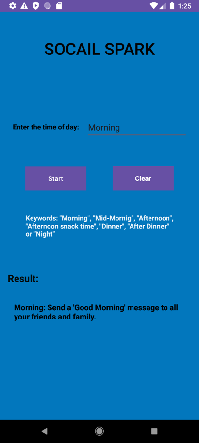
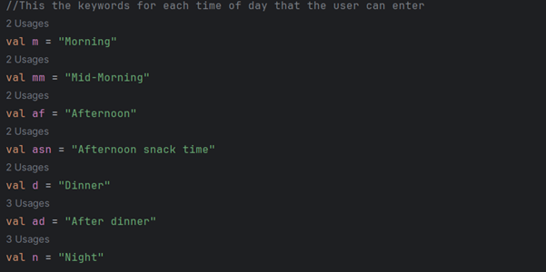
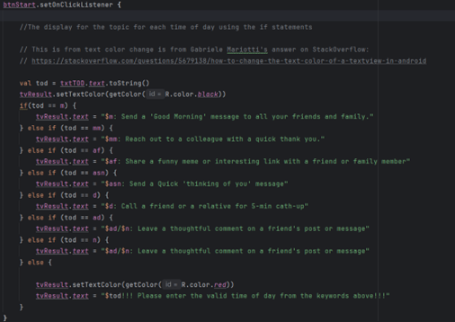

# Social Spark

## Table of Contents
<ul>
  <li>Discription</li>
  <li>Features</li>
  <li>Usage Examples</li>
  <li>Refreneces</li>
</ul>

## Discription

Social Spark is an application that gives the user ideas to maintain a social connection with other people on a daily basis. These “sparks” are suggestion that are based on the time of day, while making it fun.

## Features 
<ul>
  <li>Keywords box: it shows the valid words or phrases for the time of day.</li>
  <li>Simple UI: It’s an easy and understandable UI.</li>
  <li>Error/Mistakes: when entering the word/phrase, it will show a warning,	Colourful UI</li>
  <li>Clear</li>
</ul>

## Usage Examples
### How to use
<ol>
  
  <li>To begin with, the fields (use the keywords)</li>
  
  
  
  <li>Then activate by taping on start</li>
  
  
  
  <li>If you entered the wrong or misspelt phrase/word, an error will appear.</li>
  
  
  
  <li>If entered correctly, it will display the prompt/spark</li>
  
  
</ol>

### Code Explination
This is the declaration for the key words that will be used allowing the program to measure what it will of what shall be displayed

This code is the if/else statement which uses the values of the day which allows the program to display the correct output/message. With the colour change in if the user enters the invalid phrase the output it will display an error in red. Whereas if correct 

## Refreneces
Jc, R. (n.d.-b). How to change text color programmatically in kotlin. Stack Overflow.
https://stackoverflow.com/questions/63837502/how-to-change-text-color-programmatically-in-kotlin
